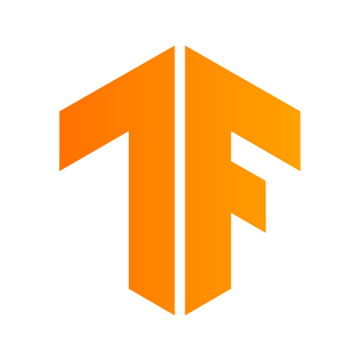

**OpenNMT** is an open source ecosystem for neural machine translation and neural sequence learning.

Started in December 2016 by the [Harvard NLP](https://nlp.seas.harvard.edu/) group and SYSTRAN, the project has since been used in [several research and industry applications](/publications). It is currently maintained by [SYSTRAN](http://www.systransoft.com/) and [Ubiqus](https://www.ubiqus.com/).

**OpenNMT provides implementations in 2 popular deep learning frameworks:**

    

        

            <a class="card-main" title="GitHub" href="https://github.com/OpenNMT/OpenNMT-py">
                
                
<strong>OpenNMT-py</strong>

                
User-friendly and multimodal implementation benefiting from PyTorch ease of use.

            </a>
            <ul>
                <li><a href="http://opennmt.net/OpenNMT-py">Documentation</a></li>
                <li><a href="/Models-py">Pretrained models</a></li>
            </ul>
        

        

            <a class="card-main" title="GitHub" href="https://github.com/OpenNMT/OpenNMT-tf">
                
                
<strong>OpenNMT-tf</strong>

                
Modular and stable implementation relying on the TensorFlow ecosystem.

            </a>
            <ul>
                <li><a href="http://opennmt.net/OpenNMT-tf">Documentation</a></li>
                <li><a href="/Models-tf">Pretrained models</a></li>
            </ul>
        

    

Each implementation has its own set of [unique features](/features) but shares similar goals:

* Highly configurable model architectures and training procedures
* Efficient model serving capabilities for use in real world applications
* Extensions to allow other tasks such as text generation, tagging, summarization, image to text, and speech to text

**The OpenNMT ecosystem also includes projects to cover the full NMT workflow:**

    

        

            <a class="card-main" title="GitHub" href="https://github.com/OpenNMT/Tokenizer">
                
<strong>Tokenizer</strong>

                
Advanced tokenization library with C++ and Python APIs.

            </a>
        

        

            <a class="card-main" title="GitHub" href="https://github.com/OpenNMT/nmt-wizard-docker">
                
<strong>nmt-wizard-docker</strong>

                
Docker-based wrapper for training and translating using a standardized interface.

            </a>
        

        

            <a class="card-main" title="GitHub" href="https://github.com/OpenNMT/nmt-wizard">
                
<strong>nmt-wizard</strong>

                
Tasks launcher and monitor on remote platforms (SSH, EC2, etc.).

            </a>
        

    

